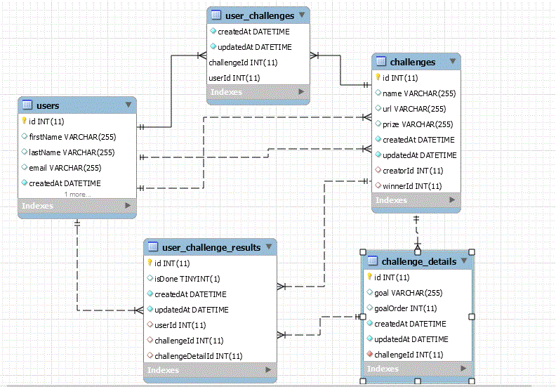
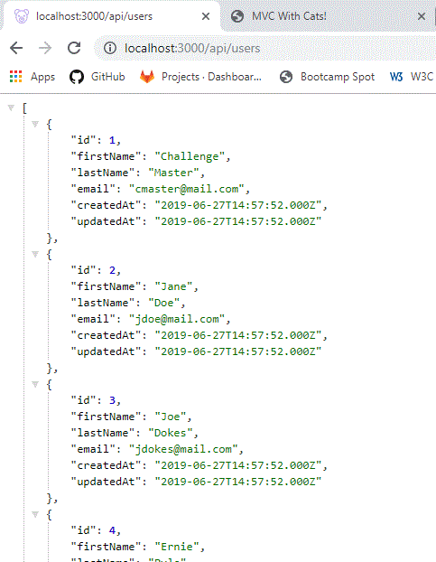

# Project 2 - Database APIs

## Schema

- We are using the Node.js package sequelize as an ORM to manage our database schema and access layer.
- The following is the current table/column depiction of the Challenge Board schema.

## API Routes

- API routes for these tables are:
- /api/users GET

- /api/users POST

- /api/users PUT

- /api/users DELETE

- /api/challenges GET

- /api/challenges POST

- /api/challenges PUT

- /api/challenges DELETE

