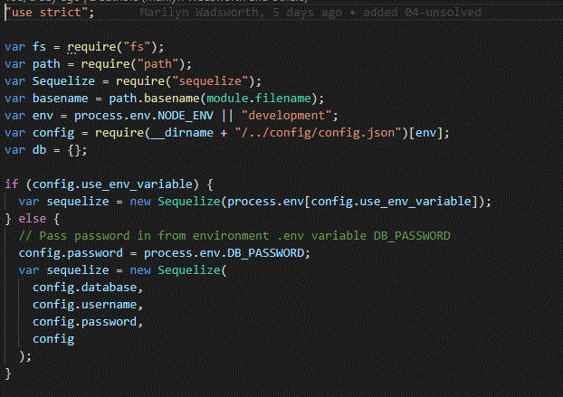
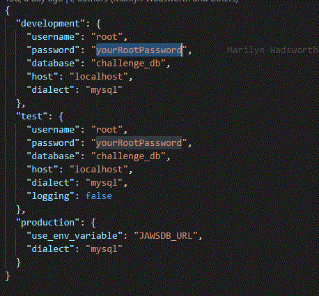
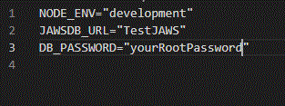
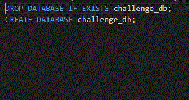

# I Challenge You - Database Information

## Database Setup

Read and follow each of the following steps carefully in order to setup the database correctly.

- Schema name - `challenge_db`

- We make our connections to the database through `./models/index.js` 

  

  

  and `./config/config.json`

  

- We use an `.env` file in the project root directory to store the database connection type as NODE_ENV for use in selecting the connection type from `config.json`. For example, NODE_ENV="test" for the test connection to a local database,  NODE_ENV="development" for the development connection to a local database, and NODE_ENV="production" for connection to the Heroku production`JawsDB` database. 
- The DB_PASSWORD environment variable sets the root password as dB_PASSWORD=`yourRootPassword`. This environment variable is read in index.js using the 'dotenv' package.

- The user needs to have the NODE_ENV and DB_PASSWORD set in a `.env` file in the app root directory in order to successfully connect to either their local database or to the Heroku production database. 

- If this is a first time use of this application, the `schema.sql` script in `./models/schema.sql` must be run in MySQL Workbench or one of the MySQL shell applications in order to create the `challenge_db` schema in your local MySQL instance. You could also just create the schema directly from the MySQL Workbench.

  

- Also, if this is your first time use of this application with your local instance of MySQL you can run the app for the first time using NODE_ENV="test" to have the sequelize models in the app create all of the tables for you. An example SQQL script for manually creating the database tables is min `./db/table_schema.sql` (use of this script is not recommended).

- Views for the app need to be created manually. These views perform table joins for common tasks used in the app. To create the `challenge_db` views run the `./db/views_schema.sql` script in MySQL workbench.

- After all of the tables and views are created, you can insert test data into `challenge_db` from the `./db/data.sql` script. This can be run in MySQL workbench.

- This should complete your database setup.